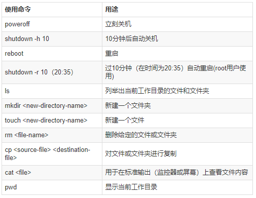
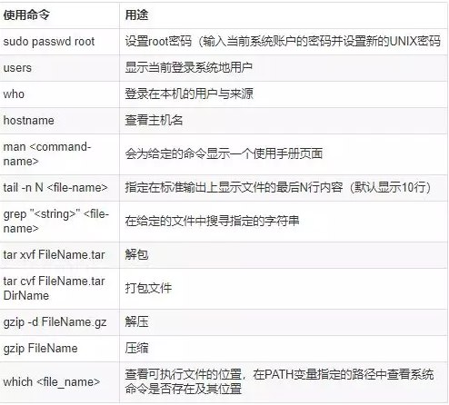

# 常用基本命令行






# 

# top 命令


- 第一行含义解释

    21：11：46—当前系统时间

    up 29 min—系统已经运行了29分钟（在这期间系统没有重启过）
    
    2users—当前有2个用户登录系统
    
    load average: 0.29, 0.28, 0.18—loadaverage—后面的三个数分别是1分钟、5分钟、15分钟的负载情况
    
    loadaverage—数据是每隔5秒钟检查一次活跃的进程数，然后按特定算法计算出的数值。如果这个数除以逻辑CPU的数量，结果高于5的时候就表明系统在超负荷运转了


- 第二行含义解释

    Tasks: 240 total, 1 running, 239 sleeping, 0 stopped, 0 zombie—系统现在共有240个进程，其中处于运行中的有1个，239个在休眠（sleep），stoped状态的有0个，zombie状态（僵尸）的有0个。
    
    第三行含义解释
    
    2.6 us—用户空间占用CPU的百分比。
    
    0.8 sy—内核空间占用CPU的百分比。
    
    0.0%ni—改变过优先级的进程占用CPU的百分比
    
    96.6 id—空闲CPU百分比
    
    0.0 wa—IO等待占用CPU的百分比
    
    0.0hi—硬中断（HardwareIRQ）占用CPU的百分比
    
    0.0si—软中断（SoftwareInterrupts）占用CPU的百分比`


- 第四行含义解释

    8081084 total—物理内存总量（80GB）
    
    1533752 used—使用中的内存总量（14GB）
    
    4966452 free—空闲内存总量（49GB）
    
    1580880 buff/cache—缓存的内存量（15G）


- 第五行含义解释(swap交换分区信息)

    0 total—交换区总量（0K）
    
    0used—使用的交换区总量（0K）
    
    0free—空闲交换区总量（0K）
    
    5930172 avail Mem—可用内存（59G）


- 第七行含义解释（各进程（任务）的状态监控）

    PID—进程id
    
    USER—进程所有者
    
    PR—进程优先级
    
    NI—nice值。负值表示高优先级，正值表示低优先级
    
    VIRT—进程使用的虚拟内存总量，单位kb。VIRT=SWAP+RES
    
    RES—进程使用的、未被换出的物理内存大小，单位kb。RES=CODE+DATA
    
    SHR—共享内存大小，单位kb
    
    S—进程状态。D=不可中断的睡眠状态R=运行S=睡眠T=跟踪/停止Z=僵尸进程
    
    %CPU—上次更新到现在的CPU时间占用百分比
    
    %MEM—进程使用的物理内存百分比
    
    TIME+—进程使用的CPU时间总计，单位1/100秒
    
    COMMAND—进程名称（命令名/命令行）
## git基本命令
``` 
git init 创建仓库

git status 查看当前状态

git log 查看历史信息记录

git add flieName 添加文件

git commit -m "备注添加信息"

git diff 查看当前修改信息详情
git diff --cache //查看已经add但是没有commit的内容
git diff HEAD //上面两个内容的合并

echo $HOME //查看git config的HOME路径
export $HOME=/c/gitconfig //配置git config的HOME路径

git checkout -- rmflie 撤销删除文件

删除库中文件 : git rm file

创建分支 : git branch newtest
删除分支 : git branch -d newtest
进入分支 : git checkout newtest
回到主分支 : git checkout master

合并分支 : git checkout master ==> git merge newtest --
对其他分支的更改不会反映在主分支上


git merge master //假设当前在test分支上面，把master分支上的修改同步到test分支上
git branch -r/-a //查看远程分支/全部分支
git fetch //把远程库的代码更新到本地库
git pull --rebase origin master //强制把远程库的代码跟新到当前分支上面
git pull origin master 拉代码
git stash list //查看所有的缓存
git stash pop //恢复本地分支到缓存状态
git stash //把未完成的修改缓存到栈容器中
git blame someFile //查看某个文件的每一行的修改记录（）谁在什么时候修改的）

git push origin master 提交代码
```

## git上传本地项目到github
- 一. 绑定用户:
  `git config --global user.name "xxx" `

  `git config --global user.email "xxx@gmail.com"`

  `git config --global credential.help store`

  查看配置:
  `git config --list`

- 二.  生成密钥对: ` ssh-keygen -t rsa -C 'XXX@gmail.com' `
  一路回车;

- 三.  把生成密钥的.pub文件里面的内容添加到github账户的SSH里面

       测试是否有效: `ssh -T git@github.com`

- 四.  上传项目

        1. 首先在github上创建一个空的项目demo
        
        2. 在本地创建demo目录: `mkdir demo && cd demo && echo "# demo " >> README.md`
        
        3. 初始化git: `git init`
        
        4. 添加当前目录所有文件: `git add . `
        
        5. 查看状态： `git status`
        
        6. 提交文件: `git commit -m "feat: init project"`
        
        7. 关联远程项目: `git remote add origin  https://github.com/olongfen/app.git(这个链接换成你的项目地址) `
        
        8. push到远程: `git push -u origin master`
          
