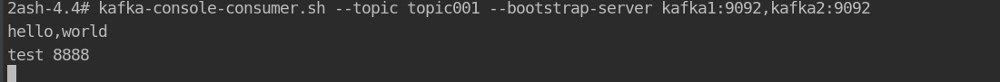

# Golang Kafka 入门

## kafka docker环境搭建
   - docker-compose.yaml   
    
    ```
    version: '3'
    services:
      zoo1:
        image: wurstmeister/zookeeper
        restart: unless-stopped
        hostname: zoo1
        ports:
          - "2181:2181"
        container_name: zookeeper
      kafka1:
        image: wurstmeister/kafka
        ports:
          - "9092:9092"
        environment:
          KAFKA_ADVERTISED_HOST_NAME: 192.168.31.180                     ## 修改:宿主机IP
          KAFKA_ADVERTISED_LISTENERS: PLAINTEXT://192.168.31.180:9092    ## 修改:宿主机IP
          KAFKA_ZOOKEEPER_CONNECT: "zoo1:2181"
          KAFKA_ADVERTISED_PORT: 9092
          KAFKA_BROKER_ID: 1
          KAFKA_OFFSETS_TOPIC_REPLICATION_FACTOR: 1
        depends_on:
          - zoo1
        container_name: kafka1
      kafka2:
        image: wurstmeister/kafka
        ports:
          - "9093:9092"
        environment:
          KAFKA_ADVERTISED_HOST_NAME: 192.168.31.180                    ## 修改:宿主机IP
          KAFKA_ADVERTISED_LISTENERS: PLAINTEXT://192.168.31.180:9093   ## 修改:宿主机IP
          KAFKA_ZOOKEEPER_CONNECT: "zoo1:2181"
          KAFKA_ADVERTISED_PORT: 9093
          KAFKA_BROKER_ID: 2
          KAFKA_OFFSETS_TOPIC_REPLICATION_FACTOR: 1
        depends_on:
          - zoo1
        container_name: kafka2
      kafka-manager:
        image: sheepkiller/kafka-manager              ## 镜像：开源的web管理kafka集群的界面
        environment:
          ZK_HOSTS: 192.168.31.180                   ## 修改:宿主机IP
        ports:
          - "9000:9000"                               ## 暴露端口
        
    ```
   - 执行docker命令
        
        `
            docker-compose up -d
        `
   - 进入docker容器中
        
        `
            docker exec -it kafka1 /bin/bash
        `    
   -  创建topic
        
        `   
            kafka.topics.sh --create --topic topic001 --partitions 1 --zookeeper zookeeper:2181  --replication-factor 1
        `
   - 获取topic
        
        `
            kafka-topics.sh --list --zookeeper zookeeper:2181
        `    
   - 进入kafka生产者    
        
        `
            kafka-console-producer.sh \
            --topic topic001 \
            --broker-list kafka1:9092,kafka2:9092
        `
   - 另外开启一个终端进入docker容器，进入kafka消费者    
        
        `
            kafka-console-producer.sh \
            --topic topic001 \
            --broker-list kafka1:9092,kafka2:9092
        ` 
        
   
       

## Golang 使用kafka示例

    *** 首先 go get github.com/Shopify/sarama ***

   - 生产者代码
   
    ```go
        package main
        
        import (
        	"encoding/json"
        	"fmt"
        	"github.com/Shopify/sarama"
        	uuid "github.com/satori/go.uuid"
        	"strconv"
        	"sync"
        )
        
        type student struct {
        	Id   string `json:"id"`
        	Name string `json:"name"`
        	Age  int    `json:"age"`
        	Sex  string `json:"sex"`
        }
        
        func main() {
        	var conf = sarama.NewConfig()
        	conf.Producer.Return.Successes = true
        	conf.Producer.RequiredAcks = sarama.WaitForAll
        	conf.Producer.Partitioner = sarama.NewRandomPartitioner
        	producer, err := sarama.NewSyncProducer([]string{"localhost:9092", "localhost:9093"}, conf)
        	if err != nil {
        		panic(err)
        	}
        	defer producer.Close()
        
        	msg := &sarama.ProducerMessage{Topic: "topic001",
        		Partition: int32(-1),
        		Key:       sarama.StringEncoder("key"),
        	}
        
        	var (
        		i  = 10000
        		wg = sync.WaitGroup{}
        	)
        	for j := 0; j < i; j++ {
        		wg.Add(1)
        		go func() {
        			defer wg.Done()
        			var s = new(student)
        			s.Id = uuid.NewV4().String()
        			println(s.Id)
        			s.Name = strconv.FormatInt(int64(i), 10)
        			s.Sex = "boy"
        			s.Age = 18
        			body, _ := json.Marshal(s)
        
        			msg.Value = sarama.ByteEncoder(body)
        			paritition, offset, err := producer.SendMessage(msg)
        
        			if err != nil {
        				fmt.Println("Send Message Fail")
        			}
        
        			fmt.Printf("Partion = %d, offset = %d\n", paritition, offset)
        		}()
        	}
        	wg.Wait()
        }
    ```
   - 消费者   
        
    ```golang
       
        package main
        
        import (
        	"fmt"
        	"github.com/Shopify/sarama"
        	"sync"
        )
        
        var (
        	wg sync.WaitGroup
        )
        
        func main() {
        	consumer, err := sarama.NewConsumer([]string{"localhost:9092", "localhost:9093"}, nil)
        
        	if err != nil {
        		panic(err)
        	}
        
        	partitionList, _err := consumer.Partitions("topic001")
        
        	if _err != nil {
        		panic(_err)
        	}
        
        	for partition := range partitionList {
        		pc, err := consumer.ConsumePartition("topic001", int32(partition), sarama.OffsetNewest)
        		if err != nil {
        			panic(err)
        		}
        
        		defer pc.AsyncClose()
        
        		wg.Add(1)
        
        		go func(sarama.PartitionConsumer) {
        			defer wg.Done()
        			for msg := range pc.Messages() {
        				fmt.Printf("Partition:%d, Offset:%d, Key:%s, Value:%s\n", msg.Partition, msg.Offset, string(msg.Key), string(msg.Value))
        			}
        		}(pc)
        		wg.Wait()
        		consumer.Close()
        	}
        }

    ```